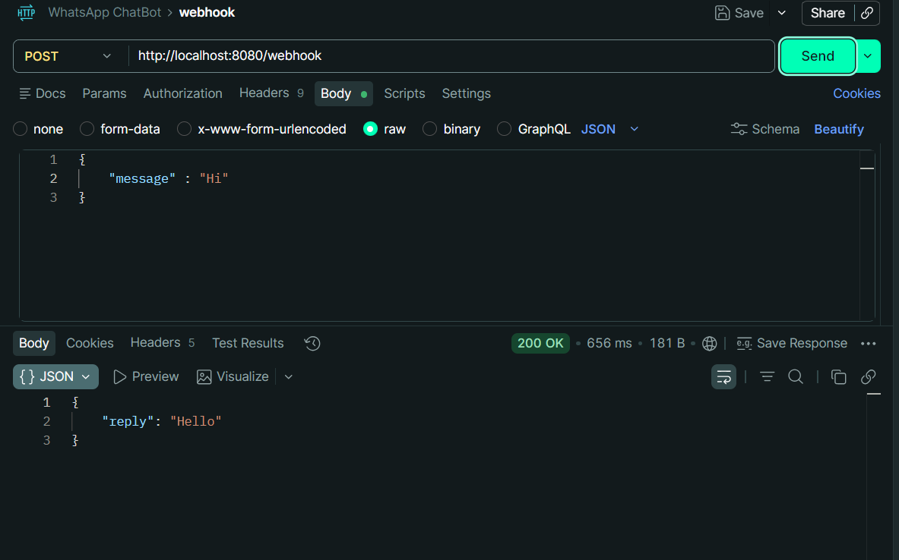

# 🚀 WhatsApp Chatbot Backend (Spring Boot)

A simple backend simulation of a WhatsApp chatbot built using Java and Spring Boot.
This project demonstrates REST API development, JSON handling, and basic chatbot logic.

---

## 📌 Features

* ✅ REST API endpoint: `/webhook`
* ✅ Accepts JSON input simulating WhatsApp messages
* ✅ Returns predefined responses:

  * **Hi → Hello**
  * **Bye → Goodbye**
* ✅ Logs all incoming messages
* ✅ Clean layered architecture (Controller → Service → Model)

---

## 🛠️ Tech Stack

* Java 17+
* Spring Boot
* Maven
* SLF4J Logging

---

## 📂 Project Structure

```
com.example.chatbot
 ├── controller   # Handles API requests
 ├── service      # Business logic
 ├── model        # Request & Response classes
```

---

## 🔗 API Endpoint

### POST `/webhook`

### 📥 Request Body

```json
{
  "message": "Hi"
}
```

### 📤 Response

```json
{
  "reply": "Hello"
}
```

---

## ▶️ How to Run Locally

1. Clone the repository:

```bash
git clone https://github.com/<your-username>/whatsapp-chatbot-springboot.git
```

2. Navigate to project folder:

```bash
cd whatsapp-chatbot-springboot
```

3. Run the application:

```bash
mvn spring-boot:run
```

4. Test API using Postman:

```
POST http://localhost:8080/webhook
```

---

## 📸 Screenshots

### 🔹 API Request & Response


### 🔹 Console Logs


---

## 🎥 Demo Video


---

## 🌐 Deployment (Bonus)


---

## 🧠 Future Improvements

* Handle more user inputs
* Add NLP-based responses
* Integrate with real WhatsApp API
* Add database for chat history

---

## 👨‍💻 Author

Akash Khab
(Java Backend Developer Trainee)
